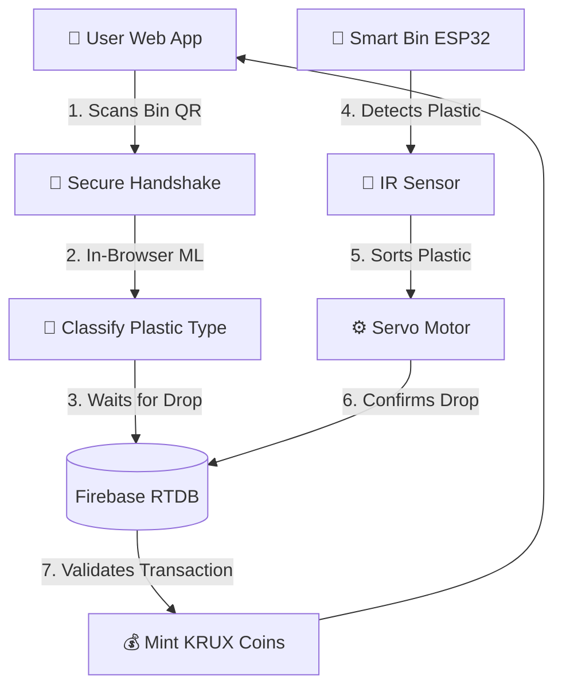

<div align="center">

# ♻️ KRUX
**Scan Plastic. Earn Rewards. Save the Planet.**

[](https://opensource.org/licenses/MIT)
[](https://reactjs.org/)
[](https://firebase.google.com/)
[](#)

*An open-source, AI-powered smart bin ecosystem designed to incentivize recycling through computer vision and gamification.*

[Live Demo](https://krux-wbh2.vercel.app/) · [Report Bug](https://github.com/vinayakec69/krux/issues) · [Request Feature](https://github.com/vinayakec69/krux/issues)

</div>

---

## 🌍 What is KRUX?

KRUX is a fully integrated hardware and software solution to combat the global plastic crisis. By combining an **ESP32-powered Smart Bin** with a **React-based Web App**, KRUX allows users to scan their plastic waste, physically deposit it into a smart bin, and earn cryptocurrency-style rewards (KRUX Coins). 

Our vision is a circular economy where recycling is not just easy, but financially rewarding.

## ✨ Features

- 🧠 **On-Device Machine Learning:** Instant plastic classification (PET, HDPE, PVC, etc.) using computer vision directly in the browser.
- ⚡ **Real-Time Hardware Sync:** The web app and physical ESP32 bin communicate instantly via Firebase Realtime Database.
- 🤖 **Automated Sorting:** The physical bin uses an IR sensor and a Servo motor to autonomously sort deposited plastics.
- 🛡️ **Advanced Fraud Detection:** Prevents users from scanning photos of plastics or non-recyclable objects to farm coins.
- 💰 **Gamification Ecosystem:** Earn KRUX coins, unlock achievements, climb the global leaderboard, and spend your coins in the sustainable marketplace.
- 📱 **Progressive Web App (PWA):** Installable on iOS and Android straight from the browser.

---

## 🏗️ System Architecture

KRUX operates on a two-part architecture working in perfect harmony:



### 1. The Physical Smart Bin (Hardware)
Built with an **ESP32 microcontroller**, a Servo motor, and an IR obstacle sensor. 
- The bin acts autonomously, detecting when an item is dropped.
- It calculates the angle required to sort the plastic and moves the servo.
- It sends an instant `HTTP PUT` request to the Firebase Realtime Database to confirm the drop.

### 2. The User App (Software)
Built with **React, Vite, Tailwind CSS, and Firebase**.
- Users scan a QR code on the bin to initiate a secure "Handshake".
- Users point their camera at the plastic waste. The in-browser ML model classifies it.
- Upon physical drop, the app intercepts the Realtime Database signal from the bin and mints KRUX coins to the user's wallet.

---

## 🚀 Getting Started

### Prerequisites
- Node.js (v18+)
- Arduino IDE (for ESP32 flashing)
- A Firebase Project (Spark Plan is fine!)

### Web App Installation

1. **Clone the repository**
   ```bash
   git clone https://github.com/vinayakec69/krux.git
   cd krux
   ```

2. **Install dependencies**
   ```bash
   npm install
   ```

3. **Set up Firebase Environment Variables**
   Create a `.env` file in the root directory:
   ```env
   VITE_FIREBASE_API_KEY=your_api_key
   VITE_FIREBASE_AUTH_DOMAIN=your_project.firebaseapp.com
   VITE_FIREBASE_PROJECT_ID=your_project
   VITE_FIREBASE_STORAGE_BUCKET=your_project.firebasestorage.app
   VITE_FIREBASE_MESSAGING_SENDER_ID=your_sender_id
   VITE_FIREBASE_APP_ID=your_app_id
   VITE_FIREBASE_DATABASE_URL=https://your-rtdb-url.firebaseio.com
   ```

4. **Run the development server**
   ```bash
   npm run dev
   ```

### Hardware Installation

1. Open `hardware/krux_bin/krux_bin.ino` in the Arduino IDE.
2. Install the `ESP32` board manager and the `Arduino_JSON` library.
3. Update the WiFi credentials and Firebase RTDB URL in the `.ino` file.
4. Flash the code to your ESP32.

---

## 🤝 Contributing

Contributions are what make the open-source community such an amazing place to learn, inspire, and create. Any contributions you make are **greatly appreciated**.

1. Fork the Project
2. Create your Feature Branch (`git checkout -b feature/AmazingFeature`)
3. Commit your Changes (`git commit -m 'Add some AmazingFeature'`)
4. Push to the Branch (`git push origin feature/AmazingFeature`)
5. Open a Pull Request

---

## 📄 License

Distributed under the MIT License. See `LICENSE` for more information.

---
<div align="center">
  <b>Built with ❤️ for a greener planet.</b>
</div>
